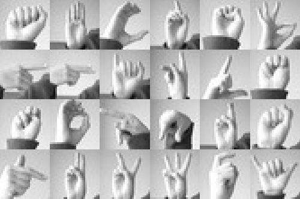

# ASL Recognition

## Insert Gif here of it working

## Just run it

`python ASLPredictor.py`

## Build one yourself

- Download dataset from this repo or kaggle
- Run one of the notebooks, modifying the model and/or the data
- Update `ASLPredictor.py` to point to the new saved model
- Run python command to use it

## Dataset

[Kaggle MNIST Sign-Language](https://www.kaggle.com/datasets/datamunge/sign-language-mnist)

### References

- [CVZone](https://github.com/cvzone/cvzone)
- [Madz2000 Kaggle Notebook](https://www.kaggle.com/code/madz2000/cnn-using-keras-100-accuracy/notebook)
